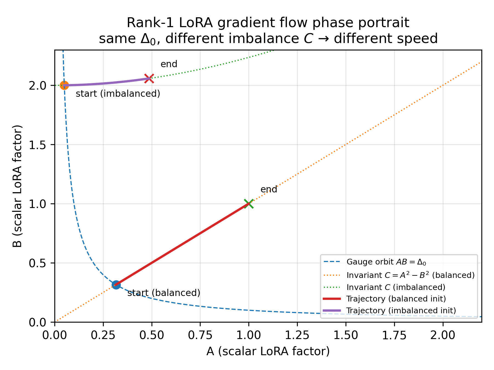

<p align="center">
  
</p>

# GP-LoRA: Gauge-Projected Low-Rank Adaptation

**Controlling Optimization Dynamics Through Gauge-Fixing Projections**

---

GP-LoRA extends Low-Rank Adaptation (LoRA) by exploiting the inherent *gauge symmetry* of the low-rank factorization to accelerate and stabilize fine-tuning. Rather than adding regularization penalties, GP-LoRA enforces an imbalance constraint *exactly* through a loss-preserving gauge projection after each optimizer step.

## Core Insight

LoRA parameterizes weight updates as a low-rank product Δ = BA. This factorization introduces:

1. **Gauge Symmetry**: The transformation (A, B) → (RA, BR⁻¹) preserves Δ for any invertible R
2. **Imbalance Invariant**: Under gradient flow, C = AA^⊤ − B^⊤B remains constant on each training trajectory

Different factorizations of the *same* Δ can exhibit dramatically different convergence rates. GP-LoRA leverages this by projecting onto favorable factorizations at each step.

<p align="center">
  
</p>

<p align="center">
  <em>Scalar rank-1 LoRA phase portrait: The vector field shows gradient flow dynamics. Green dotted lines are gauge orbits (same Δ). Red/purple lines are invariant manifolds (constant imbalance C). Orange dashed curve shows equilibria.</em>
</p>

### The Gauge Projection

After each optimizer step, GP-LoRA applies a gauge transformation that enforces:

$$AA^\top = \mu \, B^\top B$$

where μ = r/m (dimension-calibrated) by default. Crucially, this projection:
- **Preserves the forward pass**
- **Requires no additional hyperparameters**

## Quickstart

### 1. Replace layers with LoRA counterparts

```python
import loralib as lora

# Replace nn.Linear with LoRA-enabled version
layer = lora.Linear(in_features, out_features, r=8)
```

### 2. Use the GaugeProjectedOptimizer wrapper

```python
from loralib import GaugeProjectedOptimizer

# Wrap your optimizer
base_opt = torch.optim.AdamW(model.parameters(), lr=1e-4)
optimizer = GaugeProjectedOptimizer(base_opt, model, mu="auto", eps=1e-4)

# Training loop (projection happens automatically in step())
for batch in dataloader:
    loss = model(batch)
    loss.backward()
    optimizer.step()
    optimizer.zero_grad()
```

### 3. Or apply projection manually

```python
from loralib import gauge_project_model

optimizer.step()
gauge_project_model(model, mu="auto", eps=1e-4)
optimizer.zero_grad()
```

## Key Parameters

| Parameter | Default | Description |
|-----------|---------|-------------|
| `mu` | `"auto"` | Imbalance ratio. `"auto"` uses r/m (dimension-calibrated) |
| `eps` | `1e-4` | Regularization for Gram matrices (numerical stability) |
| `eig_floor` | `1e-12` | Minimum eigenvalue clamp |

## Repository Structure

```
GP-LoRA/
├── loralib/              # Core library
│   ├── layers.py         # LoRA layer implementations with gauge_project_() method
│   ├── gauge.py          # Gauge projection algorithm
│   └── utils.py          # Utilities including gauge_project_model()
├── examples/
│   ├── NLG/              # GPT-2 experiments on E2E, DART, WebNLG
│   └── NLU/              # RoBERTa/DeBERTa experiments on GLUE
└── setup.py
```

## Experiments

We provide implementations for both NLU and NLG tasks:

| Task Type | Models | Datasets | Directory |
|-----------|--------|----------|-----------|
| **NLU** | RoBERTa-base/large, DeBERTa-XXL | GLUE benchmark | [`examples/NLU/`](examples/NLU/) |
| **NLG** | GPT-2 Medium/Large | E2E, DART, WebNLG | [`examples/NLG/`](examples/NLG/) |

### Running GP-LoRA Experiments

**NLU (GLUE benchmark):**
```bash
cd examples/NLU
bash roberta_base_mnli_gplora.sh
```

**NLG (E2E dataset):**
```bash
cd examples/NLG
bash run_e2e_gplora.sh
```

## Theoretical Note

This work shows that for overparameterized gradient flows (such as the LoRA factorization Δ = BA): The imbalance C = AA^⊤ − B^⊤B is preserved under gradient flow, partitioning parameter space into disjoint invariant manifolds. Convergence speed depends on an imbalance metric—different factorizations of the same Δ can converge at arbitrarily different rates. These properties are inherent to the compositional structure itself, independent of the specific cost function.

<p align="center">
  
</p>

<p align="center">
  <em>Two initializations with the same Δ₀ but different imbalance C converge at different speeds. The imbalanced initialization (purple) reaches equilibrium faster than the balanced one (red), demonstrating initialization-dependent acceleration.</em>
</p>

GP-LoRA exploits these theoretical insights by using gauge transformations to *choose* which invariant manifold to optimize on, rather than being locked into one by initialization.

### Relationship to iLoRA

[iLoRA](https://openreview.net/pdf/6e7b608f8128ec5dc7d9d7cd085528ab1715ab22.pdf) proposes soft regularization toward AA^⊤ ≈ (r/m)B^⊤B via a penalty term, but the projection approach is more direct.

For full-rank factors with ε-regularization (see `loralib/gauge.py`):

```
G_A^ε = AA^⊤ + εI
G_B^ε = B^⊤B + εI
S^ε = (G_A^ε)^{-1/2} [(G_A^ε)^{1/2} (μ G_B^ε) (G_A^ε)^{1/2}]^{1/2} (G_A^ε)^{-1/2}
R^ε = (S^ε)^{1/2}
```

The projection (A', B') = (R·A, B·R⁻¹) satisfies A'A'^⊤ = μ B'^⊤B' while preserving B'A' = BA. The gauge projection requires O(r³) operations per LoRA layer (matrix square roots and inverses of r×r matrices). For typical ranks (r ∈ {4, 8, 16, 32}), this overhead is negligible compared to the forward/backward pass.

## Acknowledgments

This implementation builds upon the [LoRA](https://github.com/microsoft/LoRA) codebase by Microsoft Research. We thank the original authors for making their code publicly available under the MIT License.

## License

This project is licensed under the MIT License - see [LICENSE.md](LICENSE.md) for details.
